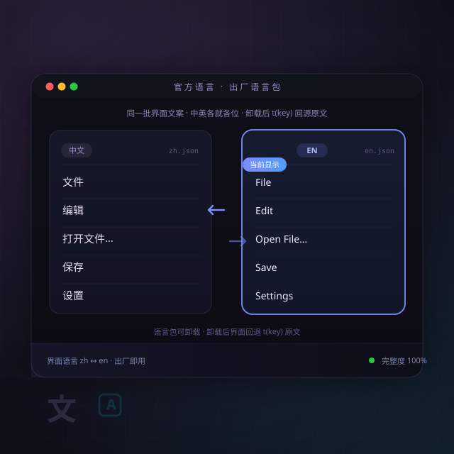

# 官方语言（lang-defaults）

> LinkDesk 官方语言包 · 出厂预装 · **可卸载**
> **理念一句话：** 语言包也是一枚插件。它是「万物皆插件」的最小示范——整个插件没有一行代码，只有两页词表（`zh.json` / `en.json`），卸载它，软件就把所有界面文字还给 key 原文。

## 这是什么

往语言注册表贡献两种语言：

- `zh`（中文）—— `zh.json`
- `en`（English）—— `en.json`

插件本体零界面、零脚本：纯 `contributes.languages` 声明。界面每处文案 `t(key)` 经当前语言词表翻出来；词表缺 key 时直接回退 key 原文，永不让界面空着。

## 可卸载的边界

它是**出厂语言包**，不是壳的一部分——在「插件 → 已安装」里卸载它之后：界面仍可用（`t(key)` 返回 key 原文），只是所有中文/English 界面文案消失。装回来即恢复。

## 语言包作者想新增一种语言？

不用动软件：写一份 `xx.json`（key = 中文原文，value = 译文），按 `contributes.languages` 声明 `id`/`label`/`path` 就能贡献第三种语言。本插件的 `en.json` 就是最好的模板。

## 图标身份（E6#69 三图模型）

- `icon`（界面/标签彩色身份图）= `resources/icon.svg` —— **Type-2 彩色块**（玫红渐变 + 两枚对开语言卡：前卡白纸带文字行 = 被 `t()` 翻译的文案）；市场列表行 = 详情顶同一张
- 场景封面见本 README 顶部 —— 不进市场展示位
